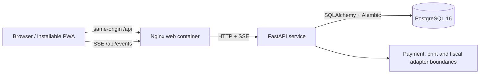

# Happy Cone project guide

## Product purpose and operating flow

Happy Cone supports the full operating day of a single ice-cream stand from ordinary phones, tablets, laptops, and desktops. The permanent sale is the system's central business record. Payment, ticketing, preparation, inventory, cash reconciliation, reporting, and audit records derive from it.

The intended flow is:

1. A cashier, manager, or owner opens the business day with the opening cash float.
2. The cashier selects products, variants, a required serving option, and optional toppings. The API calculates prices from the active catalog; client totals are never trusted.
3. The cashier records cash or a manually confirmed external mobile-money/card payment. An offline checkout may use cash only.
4. Checkout writes the order, confirmed payment, audit entry, and recipe-component stock movements as one transaction. An idempotency key prevents a retry from creating a second sale.
5. The browser presents an operational receipt with the business identity, TPIN, contact number, item codes, quantities, unit prices, payment details, cashier, change, and Turnover Tax estimate. Printing is optional and a print failure does not undo the sale.
6. The order appears in the preparation queue. A server, manager, or owner moves it through `NEW -> PREPARING -> READY -> SERVED`.
7. Managers record receipts, waste, staff use, returns, and adjustments as immutable ledger movements. A stock count records expected, counted, and variance values; it never silently changes the ledger balance.
8. A manager or owner closes the day with actual cash. The API freezes a summary including net sales, payment totals, expected cash, actual cash, and variance.
9. Reports and the audit view retain the evidence needed to reconcile sales and sensitive changes. Completed sales are preserved; a refund is an audited reversal of the financial result.

The initial payment implementations record cash and manual confirmation of payments completed on an external device. Provider gateways, printer bridges, multi-branch features, and a certified ZRA Smart Invoice/VSDC integration remain future adapter work.

## Roles

| Role | Primary work | Key limits |
| --- | --- | --- |
| `CASHIER` | Sign in, read the catalog, open/read the business day, quote and complete sales, view receipts | Cannot change stock, close the day, refund, or use management reports |
| `SERVER` | Read the catalog and live preparation queue, view receipts, advance eligible order states | Cannot alter prices, payments, stock, or cash records |
| `MANAGER` | All stand operations; create and edit categories, products, variations, prices, serving choices, extras and recipes; stock movements/counts, refunds, day close, reports and audit | Cannot delete completed financial history; archives menu records instead of deleting them |
| `OWNER_ADMIN` | Full catalog, staff, operations and reporting administration | Uses the same audited financial and stock rules |

The API owns authorization. Hiding a browser control is a usability measure and is never treated as the permission check.

## Menu and price ownership

Owners and managers set prices and item details in **Stock → Menu and stock recipes**. The same Stock page contains current inventory, movement history, physical counts, menu construction and recipes so staff can see the relationship between what is sold and what is consumed. Product creation asks first for a name and category; description and menu colour remain available under optional details. The system generates permanent item codes from names instead of asking staff to type internal identifiers. A product appears on the cashier counter only after it has at least one active variation, so an item being configured cannot interrupt the counter. Each variation is the actual sellable choice and holds its name, selling price and stock recipe. Serving choices and extras are maintained in modifier groups; each extra has its own price, availability and stock recipe.

Create the stock item in **Stock** before adding it to a recipe. Recipe quantities use the unit shown beside the field. For example, a single scoop can consume `90 g` of an ice-cream stock item and a waffle-cone extra can consume `1 each`. The system rejects duplicate ingredients and quantities that are zero or negative. Every available variation or extra must have at least one recipe ingredient; only an archived item may be saved without a recipe. This rule is enforced by both the form and the API so a sellable item cannot silently bypass stock deductions.

Item codes are generated automatically and remain permanent because receipts, reports and audit records use them. To stop selling an item, edit it and turn off **Available for sale**. Earlier receipts remain unchanged. Cashiers and servers can read the active menu but cannot change descriptions, prices, availability or recipes.

Owners and managers edit the stand profile in **Settings**. The dedicated **Receipt details** editor controls the legal business name, shop or branch name, location, TPIN, contact number, tax category, tax rate, and thank-you line. The default tax treatment is **Turnover Tax (TOT) at 5% of gross sales**. The saved profile also controls the displayed currency and timezone, payment and ticket guidance, activity introduction, and operating guide. Each update is audited. Runtime connection status, signed-in identity, historical audit events, and fiscal status are read-only system facts.

## Receipt status

The current printout is an operational receipt sized for common 58 mm and 80 mm thermal printers. Below the logo it prints the saved legal name, shop or branch, location, TPIN, and contact number. It then records the order number, stable sale reference, date and time, item and variation codes, modifiers, quantities, unit prices, total, payment details, cashier, and item count. A final tax section shows the configured TOT category and calculates the estimate directly from the gross sale total. The cashier name is copied onto the order at checkout, so a later staff-account rename does not alter an earlier receipt.

The receipt does not use the redundant **Customer Receipt** heading or add internal system messages to the customer-facing footer. It identifies the saved TPIN and tax breakdown but must not be presented as a certified Smart Invoice. Smart Invoice/VSDC identifiers, fiscal signatures, SDC/MRC values, and QR verification must come from a separately approved fiscal integration rather than invented fields. Staff can review this boundary in the protected **Fiscal status** section in Settings.

## Architecture



`apps/web` contains the React/TypeScript client. Its production build is static and can be installed as a PWA where supported. Nginx provides SPA route fallback, prevents API and service-worker caching, keeps the SSE connection open, and forwards both the web app and API through one origin.

`apps/api` contains the FastAPI composition root, thin routes, domain/application services, SQLAlchemy models, and Alembic migrations. Money crosses the API as integer ngwee; measured quantities are decimal strings. Timestamps are stored in UTC and displayed/reported in the configured branch timezone.

PostgreSQL is the deployment database and the source of truth. The database schema changes only through `python -m app.cli migrate`. SQLite supports isolated tests and the clearly labelled local demonstration mode; it is not the recommended deployment database.

SSE events tell preparation clients that database state changed. Clients reload the queue after an event or reconnect, so a missed event does not become permanent state loss. Periodic reload remains the fallback.

## Configuration and data initialization

Copy `.env.example` to `.env` for Docker Compose. The checked-in example contains development placeholders and no working shared credential. Use a unique URL-safe PostgreSQL password because Compose places it in a SQLAlchemy database URL. Keep the real `.env` out of source control.

| Variable | Purpose | Local default or requirement |
| --- | --- | --- |
| `POSTGRES_DB` | PostgreSQL database | `happycone_dev` |
| `POSTGRES_USER` | PostgreSQL role | `happycone_dev` |
| `POSTGRES_PASSWORD` | PostgreSQL password and API database URL component | Required in `.env`; no Compose fallback |
| `POSTGRES_PORT` | Host-only database port | `5432` |
| `API_PORT` | Host-only direct API port | `8000` |
| `WEB_PORT` | Host-only Nginx port | `8080` |
| `BRANCH_TIMEZONE` | Startup timezone fallback before the saved stand profile loads | `Africa/Lusaka` |
| `SESSION_HOURS` | Opaque database-backed session lifetime | `12` |
| `CORS_ORIGINS` | JSON list for direct browser-to-API development calls | Local Vite and Nginx origins |
| `APP_ENV` | Enables strict production checks when set to `production` | `development` |
| `ALLOWED_HOSTS` | JSON list accepted by the API host-header guard | Local hosts in development; public DNS plus internal health host in production |
| `LOG_LEVEL` | API and structured request log threshold | `INFO` |
| `DATABASE_URL` | SQLAlchemy connection URL | Constructed by Compose; set explicitly outside Compose |

Authentication uses random opaque sessions stored as hashes in the database. There is no shared signing key. Treat the database and its backups as sensitive.

Migrations and seeds are deliberately separate from process startup:

```bash
./scripts/migrate.sh
HAPPYCONE_SEED_PASSWORD='at-least-12-characters' ./scripts/seed-dev.sh
```

The seed is development-only. It creates the four role examples, catalog recipes, and opening inventory, but no business day or sales. The supplied password is required each time and is not stored in `.env.example`.

## Local development

The closest local deployment uses PostgreSQL and the same Nginx routing as a hosted instance:

```bash
cp .env.example .env
# Edit .env and replace POSTGRES_PASSWORD.
./scripts/dev.sh -d
./scripts/migrate.sh
HAPPYCONE_SEED_PASSWORD='at-least-12-characters' ./scripts/seed-dev.sh
```

`scripts/dev.sh` validates Compose configuration, builds images, and launches the stack. It passes any extra options to `docker compose up`, such as `-d`. It never migrates or seeds implicitly.

For native development, install Python 3.12 and Node.js 22 dependencies:

```bash
python3.12 -m venv apps/api/.venv
apps/api/.venv/bin/pip install -e './apps/api[dev]'
npm --prefix apps/web ci
```

The separate SQLite demonstration uses `apps/api/happycone-demo.db` unless `HAPPYCONE_DEMO_DATABASE_URL` selects another SQLite file:

```bash
./scripts/demo-migrate.sh
HAPPYCONE_SEED_PASSWORD='at-least-12-characters' ./scripts/demo-seed.sh
./scripts/demo.sh
```

The demo launcher binds the API and Vite development server to `127.0.0.1`. It stops the API when the Vite process exits. It does not migrate, seed, delete, or reset the SQLite database.

## Test and verification commands

Run API tests from the API directory so its pytest configuration and imports match deployment:

```bash
cd apps/api
.venv/bin/pytest
```

Run web tests and a production compilation:

```bash
cd apps/web
npm test
npm run build
```

Validate shell and Compose configuration without starting containers:

```bash
bash -n scripts/*.sh
docker compose --env-file .env config --quiet
```

After startup, verify health and proxy behavior:

```bash
curl --fail http://localhost:8080/health
curl --include http://localhost:8080/api/catalog
docker compose ps
docker compose logs --tail=100 api web db
```

An unauthenticated `/api/catalog` response should be `401`; that still confirms the same-origin route reached the API. A successful `/health` response is exactly `{"status":"ok"}`.

## Deployment runbook

The provided Compose file is a single-host deployment baseline. It binds PostgreSQL, the direct API port, and Nginx to loopback. For a networked installation, keep PostgreSQL and the direct API private and put a managed TLS reverse proxy in front of `127.0.0.1:8080`. Forward the original host/protocol and allow long-lived responses for `/api/events`.

1. Install Docker Engine and Compose on the host and place a reviewed release checkout in an application directory.
2. Create `.env` from the example. Replace the database password with a unique secret, confirm `Africa/Lusaka` (or the branch's IANA timezone), and restrict the file permissions to the deployment account.
3. Build immutable images with `docker compose build`. For repeatable releases, pin base-image digests in the deployment repository after the organization establishes an image-update process.
4. Start PostgreSQL with `docker compose up -d db` and wait for it to become healthy.
5. Back up the current PostgreSQL database before applying a release migration. Run `docker compose run --rm api python -m app.cli migrate` once.
6. Start or replace application services with `docker compose up -d api web`, then inspect `docker compose ps` and the health endpoint through the TLS proxy.
7. Do not run the development seed on a production database. Bootstrap the first owner with `python -m app.cli create-user --password-env ...`; the owner then manages staff accounts in the live Settings screen.
8. Schedule `scripts/backup.sh` with an age encryption recipient, copy backups off-host, alert on failure, and rehearse `scripts/restore.sh` on staging. The named `postgres_data` volume survives `docker compose down`, but it is not a backup.
9. Centralize container logs, monitor health/restart counts, set disk alerts, and monitor `/api/events` reconnect rates. Keep host and container images patched.

To roll back application code, redeploy the previous image only when its database expectations remain compatible with the applied migration. Database rollback needs a migration-specific, tested plan; never delete the volume as a rollback method.

## Accessibility design and release review requirements

The target is WCAG 2.2 AA for the web interface. These are design and review requirements; their presence here is not a claim that the current build has passed an accessibility audit.

- Every workflow must work by keyboard alone. Focus order must follow the visual order, focus must remain visible, dialogs must move focus inside and return it to the invoking control, and no keyboard trap is permitted.
- Touch controls used during service should be at least 44 by 44 CSS pixels with enough separation for hurried use. Primary checkout and order-state actions must remain reachable without precise pointer movement.
- Text and icons must meet AA contrast: at least 4.5:1 for normal text and 3:1 for large text and meaningful graphical controls. Order/payment/stock state must use text or an icon with an accessible name as well as color.
- Native elements are preferred. Every field needs a persistent programmatic label, instructions and errors must be associated with that field, headings must be ordered, tables need headers, and icon-only buttons need an accessible name.
- Checkout success, payment failure, offline state, synchronization results, and preparation-queue updates must be announced without moving focus unexpectedly. Use a restrained live region; repeating timers and order age must not produce constant announcements.
- Validation must preserve entered data, identify the problem in text, and place focus on an error summary or the first invalid field. Destructive or financial actions need clear names that include the target and result.
- The interface must reflow at 320 CSS pixels and remain usable at 200% zoom without clipped controls or two-dimensional page scrolling. Text size and spacing must not rely on fixed heights.
- Motion must respect `prefers-reduced-motion`. Time-based messages need sufficient reading time, and session expiry must warn the user when practical without silently losing an in-progress order.
- Customer-receipt print styles must remain legible in grayscale at 58 mm and 80 mm widths, with the order number, total, and payment status expressed in text.
- Offline and degraded states must be explicit. Network-dependent payment methods must be disabled with an explanation; the UI must never present an unconfirmed payment as successful.

Before a release, reviewers must complete keyboard-only passes for sign-in, day open/close, checkout, preparation transitions, inventory entry, refunds, and reports; inspect each page with a screen reader; test 320 px reflow and 200% zoom; check contrast with a measurement tool; and test reduced motion, offline state, validation errors, and receipt printing. Automated accessibility checks should run with component/browser tests when added, but they do not replace this manual review. Record browser, assistive technology, defects, and disposition in the release evidence.

## Implemented and planned scope

The repository implements the approved 15-task MVP roadmap. Consult `docs/implementation/progress.md` for the implementation ledger and release verification evidence. The API contract in `docs/implementation/api-contract.md` is the integration authority.

The delivered scope includes role-based sessions, full owner/manager catalog and recipe administration, inventory ledger/counts, explicit business days, idempotent checkout, cash/manual payments, operational customer receipts, the preparation queue, refunds, audit, daily reports, an offline cash queue, and adapter boundaries. Production payment gateways, certified ZRA fiscal integration, direct ESC/POS bridges, suppliers/procurement, multi-branch stock, customer accounts, delivery, loyalty, self-ordering, and forecasting remain later integrations.

Do not infer production readiness from a successful local demo. Follow `docs/implementation/deployment-runbook.md`; deployment still requires the recorded accessibility/device review, backup restore rehearsal, TLS and host monitoring, plus organization-specific fiscal/payment approvals.
