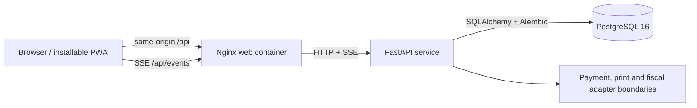

# Happy Cone project guide

## Product purpose and operating flow

Happy Cone supports the full operating day of a single ice-cream stand from ordinary phones, tablets, laptops, and desktops. The permanent sale is the system's central business record. Payment, receipt, cash reconciliation, reporting, and audit records derive from it.

The intended flow is:

1. A cashier, manager, or owner opens the business day with the opening cash float.
2. The cashier taps a simple item once or chooses only the flavour, serving, and topping sets attached to a configurable item. Repeated choices are supported. The API calculates prices from the active menu; client totals are never trusted.
3. Cash is confirmed after entering the amount received. Mobile money and Card each complete with one tap after the customer has paid, and the sale stores only the method used. Offline checkout uses Cash only.
4. Checkout writes the completed sale, confirmed payment, and audit entry as one transaction. An idempotency key prevents a retry from creating a second sale. Stock is not counted, enforced, or deducted in this release.
5. The browser presents one receipt with the business identity, location, TPIN, contact number, date and time, receipt number, items and choices, total, payment method, cashier, and cash/change values when applicable. Printing is optional and a print failure does not undo the sale.
6. A manager or owner closes the day with actual cash. The API freezes a summary including net sales, payment totals, expected cash, actual cash, and variance.
7. Reports and the audit view retain the evidence needed to reconcile sales and sensitive changes. Completed sales are preserved; a refund is an audited reversal of the financial result.

The payment implementation records Cash, Mobile money, or Card as a method. It does not store provider names, phone numbers, card details, or transaction references. Provider gateways, printer bridges, multi-branch features, stock tracking, and certified fiscal integration remain later work.

## Roles

| Role | Primary work | Key limits |
| --- | --- | --- |
| `CASHIER` | Sign in, read the menu, open/read the business day, quote and complete sales, view receipts | Cannot change the menu, close the day, refund, or use management reports |
| `MANAGER` | Create and edit categories, items, prices, choice sets and availability; refunds, day close, reports, settings and audit | Cannot delete completed financial history; archives menu records instead of deleting them |
| `OWNER_ADMIN` | Full menu, staff, settings, cash-day and reporting administration | Uses the same audited financial rules |

Historic `SERVER` accounts are preserved only for owner-led reassignment or deactivation. They cannot enter an operational workspace, and new accounts cannot be assigned that role.

The API owns authorization. Hiding a browser control is a usability measure and is never treated as the permission check.

## Menu and price ownership

Owners and managers set prices and item details on **Menu**. Create categories and reusable choice sets first, then create an item with its selling price. Attach only the choice sets the item needs and set item-specific minimum and maximum counts. For example, Double Scoop can require exactly two Flavours and one Serving choice while Soft serve cup can need no choices and add in one tap. The same flavour may be chosen twice.

The system generates permanent item codes from names instead of asking staff to type internal identifiers. An item appears at the counter only when it is available and has at least one active price. Additional price choices are available under **More menu details**. To stop selling an item, archive it; earlier receipts remain unchanged. Cashiers can read the active menu but cannot change descriptions, prices, choices, or availability.

Legacy inventory, recipe, movement, and count data is retained in the database for a later stock project. Menu setup does not ask for recipes, checkout does not validate stock, and accepted sales do not write stock movements while `inventory_tracking_enabled` is false.

Owners and managers edit the stand profile in **Settings**. The **Receipt details** editor controls the legal business name, shop or branch name, location, TPIN, contact number, paper width, and footer. The saved profile also controls the displayed currency and timezone, payment and receipt guidance, activity introduction, and operating guide. Each update is audited.

## Receipt status

The current printout is sized for common 58 mm and 80 mm thermal printers. Below the logo it prints the saved legal name, shop or branch, location, TPIN, and contact number. It then records one small **Receipt No.**, date and time, items, repeated choices in compact form such as `Vanilla ×2`, quantities, unit prices, total, payment method, cashier, and cash received/change where applicable. The cashier name is copied onto the sale at checkout, so a later staff-account rename does not alter an earlier receipt.

The receipt omits the redundant **Customer Receipt** heading, tax category, tax rate, tax treatment, payment provider, external transaction reference, serving ticket, queue number, and internal system messages. Any certified fiscal integration must add its approved fields through a separately reviewed project.

## Architecture


```mermaid
flowchart LR
    B[Browser / installable PWA] -->|same-origin /api| N[Nginx web container]
    B -->|SSE /api/events| N
    N -->|HTTP + SSE| A[FastAPI service]
    A -->|SQLAlchemy + Alembic| P[(PostgreSQL 16)]
    A --> D[Payment, print and fiscal adapter boundaries]
```

`apps/web` contains the React/TypeScript client. Its production build is static and can be installed as a PWA where supported. Nginx provides SPA route fallback, prevents API and service-worker caching, keeps the SSE connection open, and forwards both the web app and API through one origin.

`apps/api` contains the FastAPI composition root, thin routes, domain/application services, SQLAlchemy models, and Alembic migrations. Money crosses the API as integer ngwee; measured quantities are decimal strings. Timestamps are stored in UTC and displayed/reported in the configured branch timezone.

PostgreSQL is the deployment database and the source of truth. The database schema changes only through `python -m app.cli migrate`. SQLite supports isolated tests and the clearly labelled local demonstration mode; it is not the recommended deployment database.

The API retains its event and historic status interfaces for compatibility with existing data. The cashier-only web application does not expose a preparation workspace or require status transitions for new sales.

## Configuration and data initialization

Copy `.env.example` to `.env` for Docker Compose. The checked-in example contains development placeholders and no working shared credential. Use a unique URL-safe PostgreSQL password because Compose places it in a SQLAlchemy database URL. Keep the real `.env` out of source control.

| Variable | Purpose | Local default or requirement |
| --- | --- | --- |
| `POSTGRES_DB` | PostgreSQL database | `happycone_dev` |
| `POSTGRES_USER` | PostgreSQL role | `happycone_dev` |
| `POSTGRES_PASSWORD` | PostgreSQL password and API database URL component | Required in `.env`; no Compose fallback |
| `POSTGRES_PORT` | Host-only database port | `5432` |
| `API_PORT` | Host-only direct API port | `8000` |
| `WEB_PORT` | Host-only Nginx port | `8080` |
| `BRANCH_TIMEZONE` | Startup timezone fallback before the saved stand profile loads | `Africa/Lusaka` |
| `SESSION_HOURS` | Opaque database-backed session lifetime | `12` |
| `CORS_ORIGINS` | JSON list for direct browser-to-API development calls | Local Vite and Nginx origins |
| `APP_ENV` | Enables strict production checks when set to `production` | `development` |
| `ALLOWED_HOSTS` | JSON list accepted by the API host-header guard | Local hosts in development; public DNS plus internal health host in production |
| `LOG_LEVEL` | API and structured request log threshold | `INFO` |
| `DATABASE_URL` | SQLAlchemy connection URL | Constructed by Compose; set explicitly outside Compose |

Authentication uses random opaque sessions stored as hashes in the database. There is no shared signing key. Treat the database and its backups as sensitive.

Migrations and seeds are deliberately separate from process startup:

```bash
./scripts/migrate.sh
HAPPYCONE_SEED_PASSWORD='at-least-12-characters' ./scripts/seed-dev.sh
```

The seed is development-only. It creates example staff and menu records, but no business day or sales. The supplied password is required each time and is not stored in `.env.example`.

## Local development

The closest local deployment uses PostgreSQL and the same Nginx routing as a hosted instance:

```bash
cp .env.example .env
# Edit .env and replace POSTGRES_PASSWORD.
./scripts/dev.sh -d
./scripts/migrate.sh
HAPPYCONE_SEED_PASSWORD='at-least-12-characters' ./scripts/seed-dev.sh
```

`scripts/dev.sh` validates Compose configuration, builds images, and launches the stack. It passes any extra options to `docker compose up`, such as `-d`. It never migrates or seeds implicitly.

For native development, install Python 3.12 and Node.js 22 dependencies:

```bash
python3.12 -m venv apps/api/.venv
apps/api/.venv/bin/pip install -e './apps/api[dev]'
npm --prefix apps/web ci
```

The separate SQLite demonstration uses `apps/api/happycone-demo.db` unless `HAPPYCONE_DEMO_DATABASE_URL` selects another SQLite file:

```bash
./scripts/demo-migrate.sh
HAPPYCONE_SEED_PASSWORD='at-least-12-characters' ./scripts/demo-seed.sh
./scripts/demo.sh
```

The demo launcher binds the API and Vite development server to `127.0.0.1`. It stops the API when the Vite process exits. It does not migrate, seed, delete, or reset the SQLite database.

## Test and verification commands

Run API tests from the API directory so its pytest configuration and imports match deployment:

```bash
cd apps/api
.venv/bin/pytest
```

Run web tests and a production compilation:

```bash
cd apps/web
npm test
npm run build
```

Validate shell and Compose configuration without starting containers:

```bash
bash -n scripts/*.sh
docker compose --env-file .env config --quiet
```

After startup, verify health and proxy behavior:

```bash
curl --fail http://localhost:8080/health
curl --include http://localhost:8080/api/catalog
docker compose ps
docker compose logs --tail=100 api web db
```

An unauthenticated `/api/catalog` response should be `401`; that still confirms the same-origin route reached the API. A successful `/health` response is exactly `{"status":"ok"}`.

## Deployment runbook

The provided Compose file is a single-host deployment baseline. It binds PostgreSQL, the direct API port, and Nginx to loopback. For a networked installation, keep PostgreSQL and the direct API private and put a managed TLS reverse proxy in front of `127.0.0.1:8080`. Forward the original host/protocol and allow long-lived responses for `/api/events`.

1. Install Docker Engine and Compose on the host and place a reviewed release checkout in an application directory.
2. Create `.env` from the example. Replace the database password with a unique secret, confirm `Africa/Lusaka` (or the branch's IANA timezone), and restrict the file permissions to the deployment account.
3. Build immutable images with `docker compose build`. For repeatable releases, pin base-image digests in the deployment repository after the organization establishes an image-update process.
4. Start PostgreSQL with `docker compose up -d db` and wait for it to become healthy.
5. Back up the current PostgreSQL database before applying a release migration. Run `docker compose run --rm api python -m app.cli migrate` once.
6. Start or replace application services with `docker compose up -d api web`, then inspect `docker compose ps` and the health endpoint through the TLS proxy.
7. Do not run the development seed on a production database. Bootstrap the first owner with `python -m app.cli create-user --password-env ...`; the owner then manages staff accounts in the live Settings screen.
8. Schedule `scripts/backup.sh` with an age encryption recipient, copy backups off-host, alert on failure, and rehearse `scripts/restore.sh` on staging. The named `postgres_data` volume survives `docker compose down`, but it is not a backup.
9. Centralize container logs, monitor health/restart counts, set disk alerts, and monitor `/api/events` reconnect rates. Keep host and container images patched.

To roll back application code, redeploy the previous image only when its database expectations remain compatible with the applied migration. Database rollback needs a migration-specific, tested plan; never delete the volume as a rollback method.

## Accessibility design and release review requirements

The target is WCAG 2.2 AA for the web interface. These are design and review requirements; their presence here is not a claim that the current build has passed an accessibility audit.

- Every workflow must work by keyboard alone. Focus order must follow the visual order, focus must remain visible, dialogs must move focus inside and return it to the invoking control, and no keyboard trap is permitted.
- Touch controls used during service should be at least 44 by 44 CSS pixels with enough separation for hurried use. Primary checkout actions must remain reachable without precise pointer movement.
- Text and icons must meet AA contrast: at least 4.5:1 for normal text and 3:1 for large text and meaningful graphical controls. Sale, payment, and stock state must use text or an icon with an accessible name as well as color.
- Native elements are preferred. Every field needs a persistent programmatic label, instructions and errors must be associated with that field, headings must be ordered, tables need headers, and icon-only buttons need an accessible name.
- Checkout success, payment failure, offline state, and synchronization results must be announced without moving focus unexpectedly. Use a restrained live region.
- Validation must preserve entered data, identify the problem in text, and place focus on an error summary or the first invalid field. Destructive or financial actions need clear names that include the target and result.
- The interface must reflow at 320 CSS pixels and remain usable at 200% zoom without clipped controls or two-dimensional page scrolling. Text size and spacing must not rely on fixed heights.
- Motion must respect `prefers-reduced-motion`. Time-based messages need sufficient reading time, and session expiry must warn the user when practical without silently losing an in-progress sale.
- Customer-receipt print styles must remain legible in grayscale at 58 mm and 80 mm widths, with the receipt number, total, and payment status expressed in text.
- Offline and degraded states must be explicit. Network-dependent payment methods must be disabled with an explanation; the UI must never present an unconfirmed payment as successful.

Before a release, reviewers must complete keyboard-only passes for sign-in, day open/close, checkout, inventory entry, refunds, and reports; inspect each page with a screen reader; test 320 px reflow and 200% zoom; check contrast with a measurement tool; and test reduced motion, offline state, validation errors, and receipt printing. Automated accessibility checks should run with component/browser tests when added, but they do not replace this manual review. Record browser, assistive technology, defects, and disposition in the release evidence.

## Implemented and planned scope

The repository implements the approved 15-task MVP roadmap. Consult `docs/implementation/progress.md` for the implementation ledger and release verification evidence. The API contract in `docs/implementation/api-contract.md` is the integration authority.

The delivered scope includes role-based sessions, full Owner administrator and Manager menu administration, product-specific choices, explicit business days, idempotent completed checkout, Cash/Mobile money/Card method recording, one sales receipt, refunds, audit, daily reports, an offline cash queue, and adapter boundaries. Production payment gateways, certified ZRA fiscal integration, direct ESC/POS bridges, stock counting, suppliers/procurement, multi-branch operation, customer accounts, delivery, loyalty, self-ordering, and forecasting remain later integrations.

Do not infer production readiness from a successful local demo. Follow `docs/implementation/deployment-runbook.md`; deployment still requires the recorded accessibility/device review, backup restore rehearsal, TLS and host monitoring, plus organization-specific fiscal/payment approvals.
